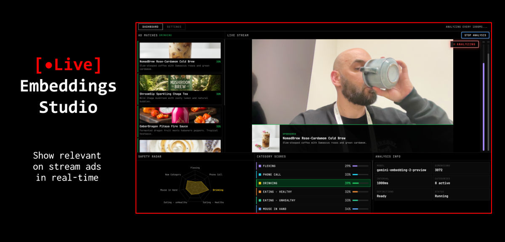
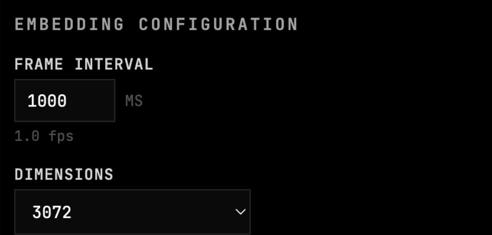
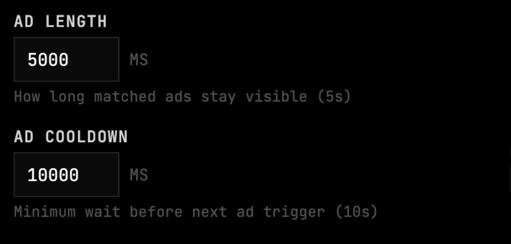
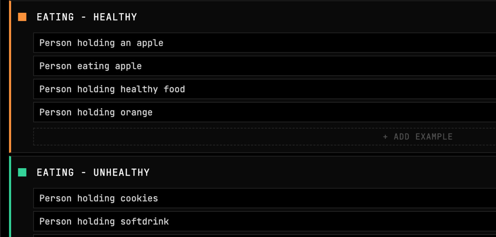
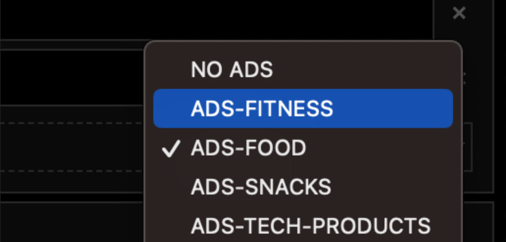
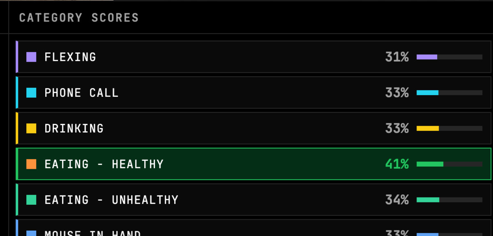
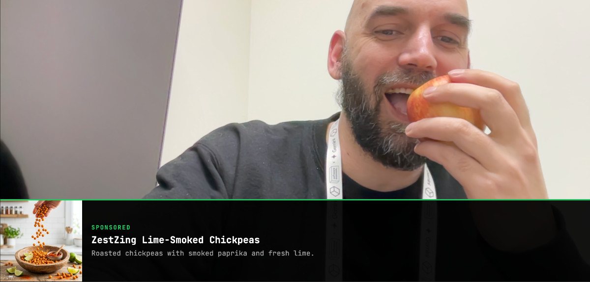

# [Live] Embeddings Studio

Show relevant on-stream ads in real-time using multimodal embeddings.



Live Embeddings Studio captures your webcam feed, embeds each frame using the Gemini API, and matches it against categories you define — triggering contextually relevant ads in real-time. All similarity search is powered by Qdrant.

## Prerequisites

- **Node.js** v18+ — [download](https://nodejs.org/)
- **Docker** — needed to run Qdrant ([install](https://docs.docker.com/get-docker/))

## Quick Start

### 1. Get a Gemini API Key

Go to [Google AI Studio](https://aistudio.google.com/apikey) and create a free API key. The project uses the `gemini-embedding-2-preview` model which is available on the free tier.

### 2. Start Qdrant

Run Qdrant in Docker (one command, no config needed):

```bash
docker run -d --name qdrant -p 6333:6333 qdrant/qdrant
```

Verify it's running by opening http://localhost:6333/dashboard in your browser.

### 3. Clone and Install

```bash
git clone https://github.com/anthropics/live-embeddings-studio.git
cd live-embeddings-studio
cd dashboard && npm install
```

### 4. Configure Environment

```bash
cd ..  # back to repo root
cp .env.example .env
```

Edit `.env` and paste your Gemini API key:

```
VITE_GOOGLE_API_KEY=your-actual-key-here
VITE_QDRANT_URL=http://localhost:6333
```

### 5. Run the Dashboard

```bash
cd dashboard
npm run dev
```

Open the URL shown in the terminal (usually http://localhost:5173).

## How to Use

### Step 1: Configure Settings

Go to the **Settings** tab. The defaults work well, but you can adjust:

| Setting | Default | Description |
|---------|---------|-------------|
| Frame Interval | 1000ms | How often to capture and embed a frame (1fps) |
| Dimensions | 3072 | Embedding vector size (higher = more accurate, slower) |
| Detection Threshold | 0.38 | Similarity score needed to trigger an ad |
| Ad Length | 5000ms | How long a matched ad stays visible |
| Ad Cooldown | 10000ms | Minimum wait before the next ad can trigger |




### Step 2: Define Categories

Each category has a name and one or more **text examples** describing what it looks like on camera. These text descriptions are embedded and compared against live video frames. Add more examples for better accuracy.



### Step 3: Initialize Ads and Map Categories

Still in **Settings**:

1. Click **Initialize Example Ads** — this embeds the built-in ad dataset (40 ads across 4 categories) and stores them in Qdrant. This takes ~1 minute.
2. For each category, select an **ads collection** from the dropdown — this controls which ads appear when that category is detected.



### Step 4: Preprocess Definitions

Click **Preprocess Definitions** to embed all category text examples into Qdrant. Wait until the status shows "Ready".

### Step 5: Start Analysis

Switch to the **Dashboard** tab:

1. Click **Start Camera** and allow webcam access
2. Click **Start Analysis**

The system will now continuously:
- Capture a frame from your webcam
- Embed it as an image via the Gemini API
- Search Qdrant for the most similar category
- When a score exceeds the detection threshold, find and display the best matching ad





## Populating Ads via Script

Alternatively, populate ad collections from the command line:

```bash
node scripts/populate-ads.mjs
```

This reads `assets/ads_dataset.csv`, embeds each ad's text via Gemini, and stores the vectors in Qdrant collections (`ads-food`, `ads-fitness`, `ads-snacks`, `ads-tech-products`).

## Tech Stack

- **Frontend**: React + TypeScript + Vite
- **Embeddings**: [Gemini API](https://ai.google.dev/gemini-api/docs/embeddings) (`gemini-embedding-2-preview`) — multimodal text + image embedding
- **Vector Search**: [Qdrant](https://qdrant.tech/)
- **Visualization**: Recharts (radar chart)
- **Video Processing**: [Smelter](https://github.com/software-mansion/smelter) (`@swmansion/smelter-*`)
